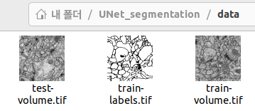

# UNet_pytorch
reference
: https://www.youtube.com/@hanyoseob/videos  
</br>


---
## Dataset
- 해당 레포지토리 git clone 후 data 디렉토리 내에 데이터 파일 저장
  
  Data download: https://github.com/alexklibisz/isbi-2012  
  
    
    위와 같은 형식이 되도록 한 뒤, process_data.py 파일을 실행해 데이터 전처리 수행

```
python process_data.py --dir_data="데이터 디렉토리 경로"
```
위 명령을 실행하면 train data 24장, validation data 3장, test data 3장으로 랜덤하게 나눠진다.

---

## How to use
run_unet.ipynb 파일 참조

## About files
### dataset.py
- 데이터셋 로드 및 transform 관련 

### display_data.py
- 데이터셋 시각화 위함. numpy형태의 데이터를 png로 변환해 확인할 수 있도록 함

### display_results.py
- test 결과로 생성된 result 디렉토리 내 파일들을 통해 테스트셋에 대한 결과를 시각화할 수 있음

### model.py
- UNet 모델 구현 (pytorch)

### process_data.py
- 원본 tif파일들의 각 슬라이드를 분할해 numpy형태로 저장하기 위함

### train.py
- run_unet.ipynb를 통해 사용법 참고. train과 evaluation이 가능하도록 함
```
!python3 "/content/drive/MyDrive/UNet_segmentation/train.py" \
--lr 1e-3 --batch_size 4 --num_epoch 15 \
--data_dir "/content/drive/MyDrive/UNet_segmentation/data" \
--ckpt_dir "/content/drive/MyDrive/UNet_segmentation/checkpoint" \
--log_dir "/content/drive/MyDrive/UNet_segmentation/log" \
--result_dir "/content/drive/MyDrive/UNet_segmentation/result" \
--mode "train" \
--train_continue "off"
```

### util.py
- 모델 저장 및 로드 관련 함수

### result_example
- 결과 예시